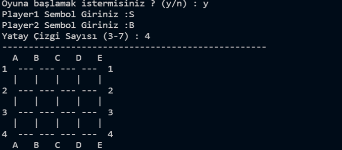
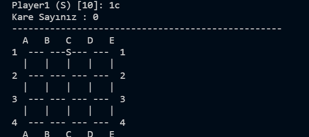
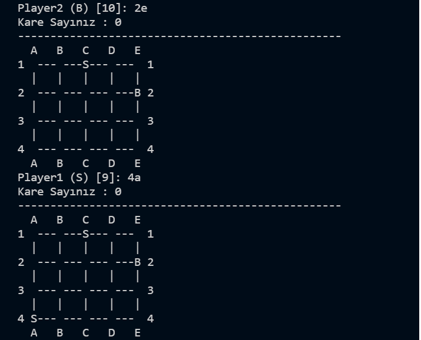
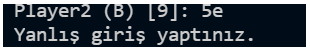
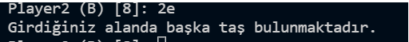
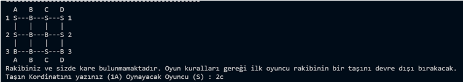
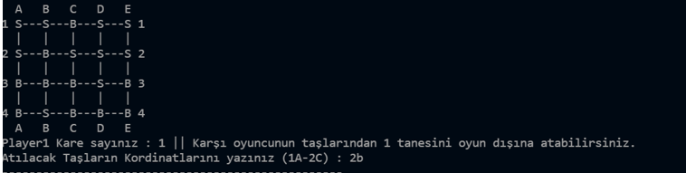
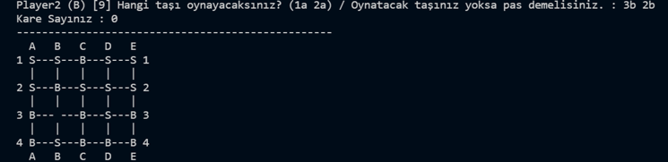
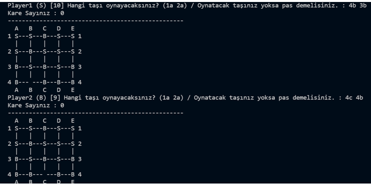
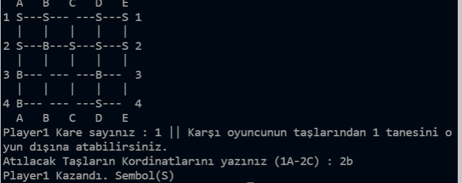

# Sqaure Games
Kare Kapan (Sqaure Games) oyunu 2 kişi ile oynanan bir strateji oyunudur. Oyun alanında, 7 yatay ve 8 dikey
çizginin oluşturduğu 42 adet kare bulunmaktadır. Oyun, 28 beyaz ve 28 siyah taş ile oynanır.
Oyunun amacı rakibin taş sayısını 3’e indirmektir.
Beyaz taşlarla oynayan oyuncu önce başlar. Sırası gelen oyuncu çizgilerin kesiştiği herhangi bir
noktaya taş yerleştirerek kare elde etmeye çalışır. Oyuncuların ellerindeki taşlar bitene kadar sıra
ile taşlar yerleştirilmeye devam edilir. Bütün taşlar yerleştirilinceye kadar oyunda hiçbir taş
hareket ettirilemez veya taşlarla hamle yapılamaz.
Bütün taşlar yerleştirildikten sonra oyuncular elde ettikleri kareleri sayarlar ve elde ettikleri kare
sayısı kadar seçecekleri rakip taşını oyun dışına çıkarırlar. Eğer hiçbir oyuncu kare elde
edememişse, ilk oyuncu (beyaz taşlarla oynayan oyuncu) rakip taşlarından birini oyun dışına
çıkarır. Oyunun herhangi bir aşamasında, dışarı çıkarılacak bir rakip taşı seçilirken oluşmuş kareler
bozulamaz.
Daha sonra hamle sırası gelen oyuncu, kendi taşlarından birisini hareket ettirerek kare oluşturmaya
çalışır. Önü boş olan taş istenildiği kadar yatay ya da dikey hareket ettirilebilir ancak taşların
üzerinden hiçbir durumda atlanamaz. Yeni bir kare oluşturulduğu an, seçilen bir rakip taşı dışarı
çıkarılır. Rakibin taş sayısını 3’e düşüren oyuncu oyunu kazanır.       
Örnek bir oyun için bakınız: [örnek oyun](https://www.youtube.com/watch?v=4A1vGGDkAIg&t=178s)

Bu projede Square Game adlı oyun Python(3.7.4) ile kodlanmıştır. 
Önce oyuna başlamak isteyip istemediğinizi sorar eğer “y” derseniz sizden Player1 için sembol daha sonra Player2 için sembol isteyecektir. Daha sonra yatay çizgi sayısını girdiğinizde oyun oynayacağınız tahtayı ilk halini görüntülenir.       

        

Daha sonra sırası ile oyuncuların tahtaya taşları yerleştirmeleri için gereken kordinatları girmeniz gerekli ve her bir taş girdiğinizde o andaki kare sayının ve tahtayı anlık olarak göstermektedir. Aşağıda birkaç örnek görmektesiniz.         
        
        

Eğer  var olmayan bir konumu seçerseniz şöyle bir hata mesajı alacaksınız:      
       

Eğer daha önce taş olan konuma taş koymaya çalışırsanız alacağınız hata şöyle olacaktır :  
       
 
Bütün taş yerleştirme bittiğinde göreceğiniz tahta örnek olarak söyle olacaktır :   
        

Gördüğünüz gibi eğer herhangi bir kare yok ise ilk oyuncu rakibinin bir taşını devre dışı bırakacak.
Eğer kare oluşmuşsa şöyle çıktı alacaksınız :   
       

Player 1’in kare sayısı ve karşı oyuncudan alacağı taş sayısı ve gideceği konum. Player 2 oynayınca oluşan tahta.
       

Aşağıda oyunun herhangi bir anındaki görüntüsünü görmektesiniz:   
       

En sonda oyunu kazanan kişi ve tahtanın son hali için bir örnek görmektesiniz :    
       

